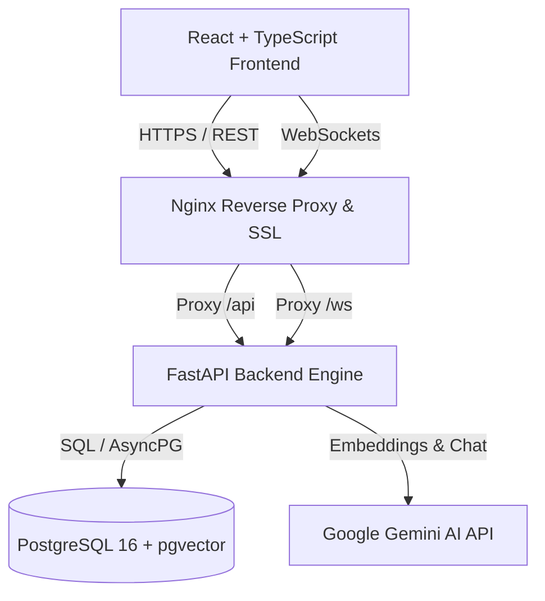
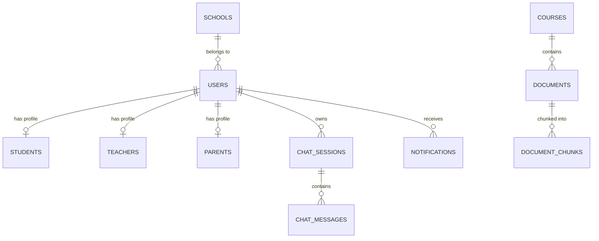

# NEXORA – AI Classroom Platform

**NEXORA** is an enterprise-grade, production-ready AI-powered Classroom & School Management Platform built with **FastAPI**, **React (TypeScript)**, **PostgreSQL with pgvector**, and **Google Gemini AI**.

---

## 🏗️ System Architecture



---

## 🗄️ Database ER Diagram



---

## 📂 Project Folder Structure

```
d:\crew_project\
├── backend/
│   ├── app/
│   │   ├── api/
│   │   │   ├── dependencies.py
│   │   │   ├── api_v1.py
│   │   │   └── routes/ (auth, documents, chat, teachers, students, parents, dashboard, notifications)
│   │   ├── core/ (config, security, rbac, logging)
│   │   ├── database/ (base, session, mixins)
│   │   ├── models/ (37 mapped ORM entities: user, course, document, chat, audit, notification)
│   │   ├── schemas/ (pydantic request/response validation schemas)
│   │   ├── services/ (rag, embedding, retrieval, chat_session, document, teacher, student, parent, admin, notification)
│   │   └── main.py
│   ├── alembic/ (database migrations 0001 - 0007)
│   ├── tests/ (11 comprehensive pytest modules)
│   ├── Dockerfile
│   └── requirements.txt
├── frontend/
│   ├── src/ (contexts, components, pages)
│   └── Dockerfile
├── nginx/ (nginx.conf reverse proxy with SSL)
├── docker-compose.yml (development environment)
├── docker-compose.prod.yml (production environment)
├── TESTING.md
├── DEPLOYMENT.md
├── ARCHITECTURE.md
└── README.md
```

---

## ⚡ Quickstart Guide

### 1. Prerequisites
- Docker v24.0+ & Docker Compose v2.20+
- Python 3.11+
- Node.js 20+

### 2. Environment Setup

Create `.env` inside `backend/`:

```env
POSTGRES_DB=nexora_db
POSTGRES_USER=postgres
POSTGRES_PASSWORD=postgres
JWT_SECRET=super_secret_nexora_jwt_key_2026
GOOGLE_API_KEY=your_google_gemini_api_key_here
ENVIRONMENT=development
```

### 3. Launch Development Environment

```bash
docker compose up -d --build
```

Access the applications:
- **Frontend**: http://localhost:3000
- **Backend API Docs**: http://localhost:8000/docs
- **Health Check**: http://localhost:8000/health
- **Prometheus Metrics**: http://localhost:8000/metrics

---

## 🔑 Environment Variables Reference

| Variable | Default Value | Description |
| :--- | :--- | :--- |
| `POSTGRES_DB` | `nexora_db` | PostgreSQL Database Name |
| `POSTGRES_USER` | `postgres` | Database Username |
| `POSTGRES_PASSWORD` | `postgres` | Database Password |
| `JWT_SECRET` | `super_secret...` | 256-bit JWT Signing Key |
| `GOOGLE_API_KEY` | `(required)` | Google Gemini API Key |
| `GEMINI_CHAT_MODEL` | `gemini-2.5-flash` | Gemini Chat Model Name |
| `GEMINI_EMBEDDING_MODEL` | `models/gemini-embedding-001` | Gemini Embedding Model Name |

---

## 🤖 RAG & Gemini Integration Guide

1. **Document Upload & Multi-Format Parsing**: Upload `.pdf`, `.docx`, `.pptx`, `.txt`, or image files via `POST /api/v1/documents/upload`.
2. **Text Chunking & Embedding**: Document text is split into 800-character chunks with 150-character overlaps and converted into 768-dimensional vectors using Google Gemini.
3. **pgvector Storage & Hybrid Search**: Embeddings are stored in `document_chunks` with HNSW indexing. Vector similarity is queried using cosine distance (`<=>`) combined with keyword matching.
4. **Context Grounding**: AI Chat queries pass retrieved document chunks into Gemini system prompts with strict hallucination-suppression instructions.

---

## 🧪 Testing

Execute backend test suite:

```bash
cd backend
.\.venv\Scripts\python.exe -m pytest tests/ -v
```

---

## 🚀 Production Deployment

Refer to [DEPLOYMENT.md](file:///d:/crew_project/DEPLOYMENT.md) for full instructions on deploying to **OCI**, **AWS**, **Azure**, and **Linux VMs**.
